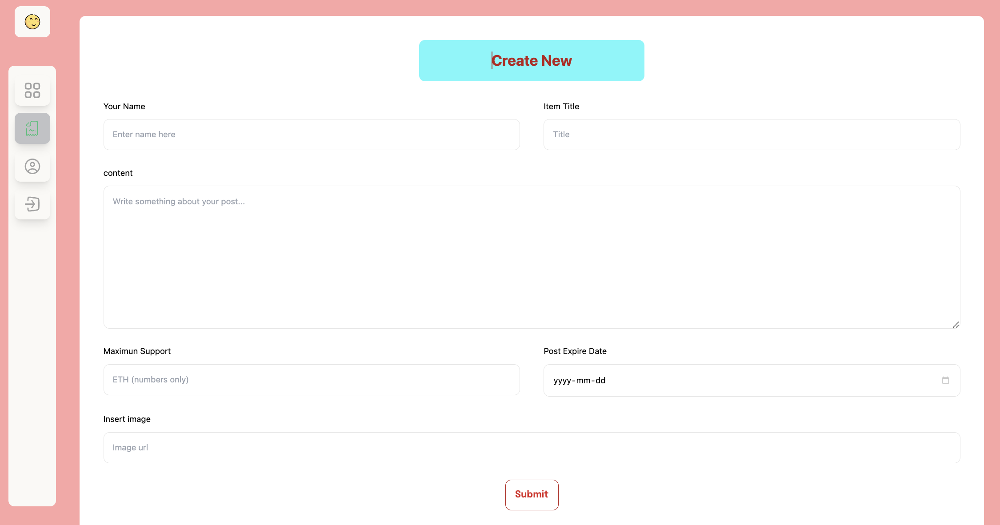
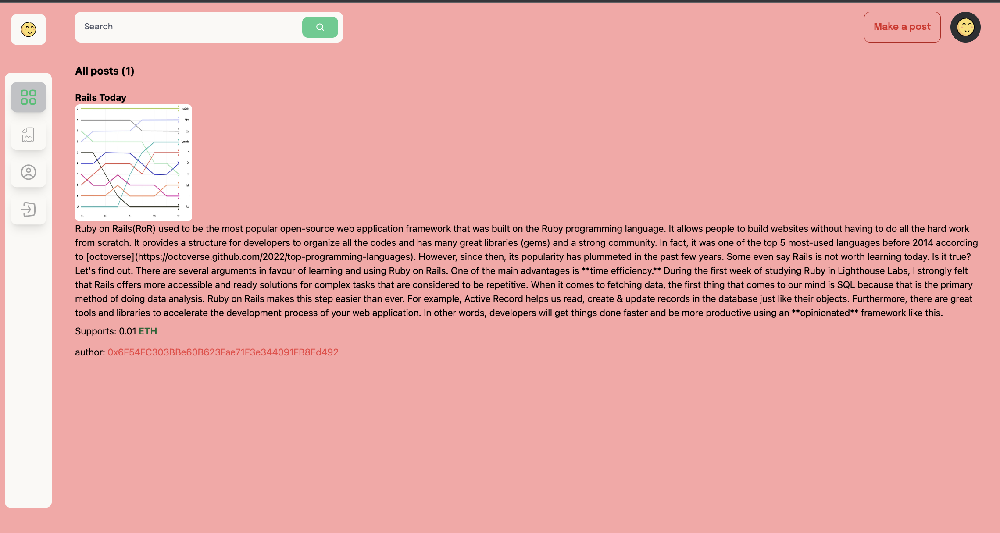

# Blog Platform with Blockchain

---

# Into

A practice project for sending donations to suppor content creators in a secure way by utlizing blockchain. With solidity language, we are able to create smart contracts.
We can create a post, view posts and most importantly, we can send Ethereum as donations through the blockchain network.

---

# Showcase

https://user-images.githubusercontent.com/25517478/221650097-c7ebe5ab-b980-43da-8266-fac37add3175.mov

# Tech Stack

- web3
- Blockchain
- Solidity
- Smart contracts
- React
- Tailwind CSS
